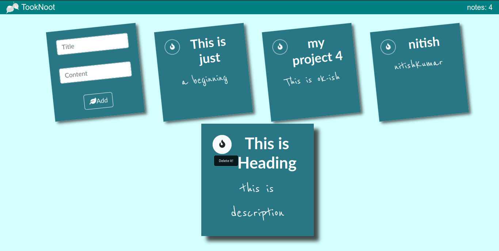

# learn-React

contains practice projects for learning react concepts on my own.

#### The ScreenShot of Project-1 built for functionality practice

#### The ScreenShot of Project-2 built for functionality practice

#### The ScreenShot of Project-3 built for functionality practice

#### The ScreenShot of Project-4 built for functionality practice

